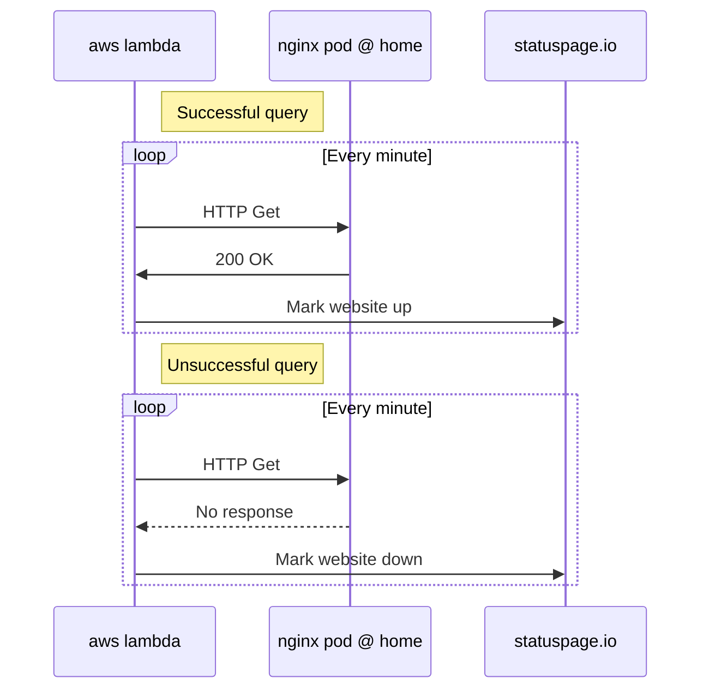
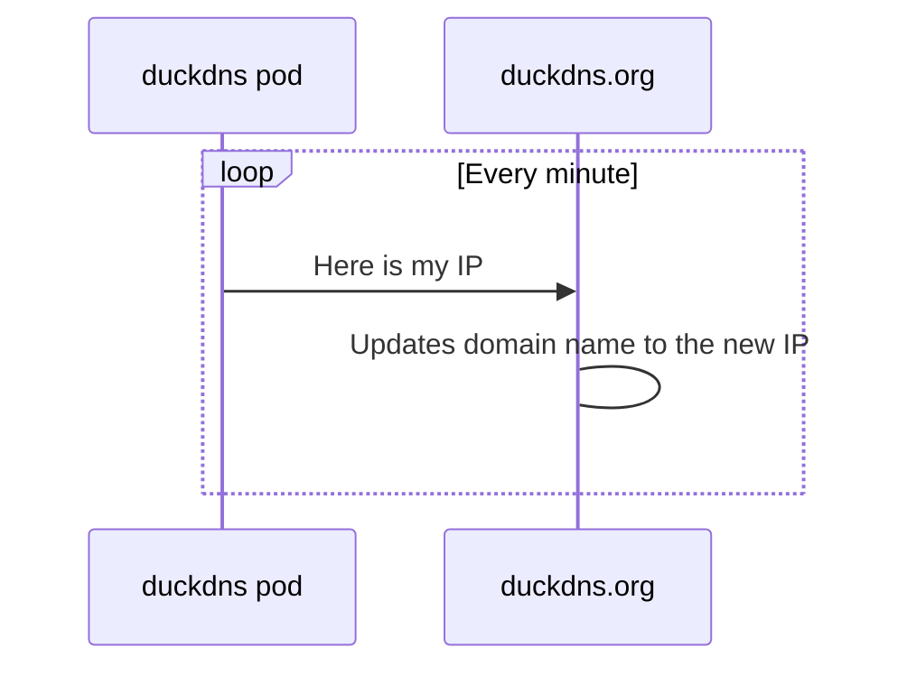
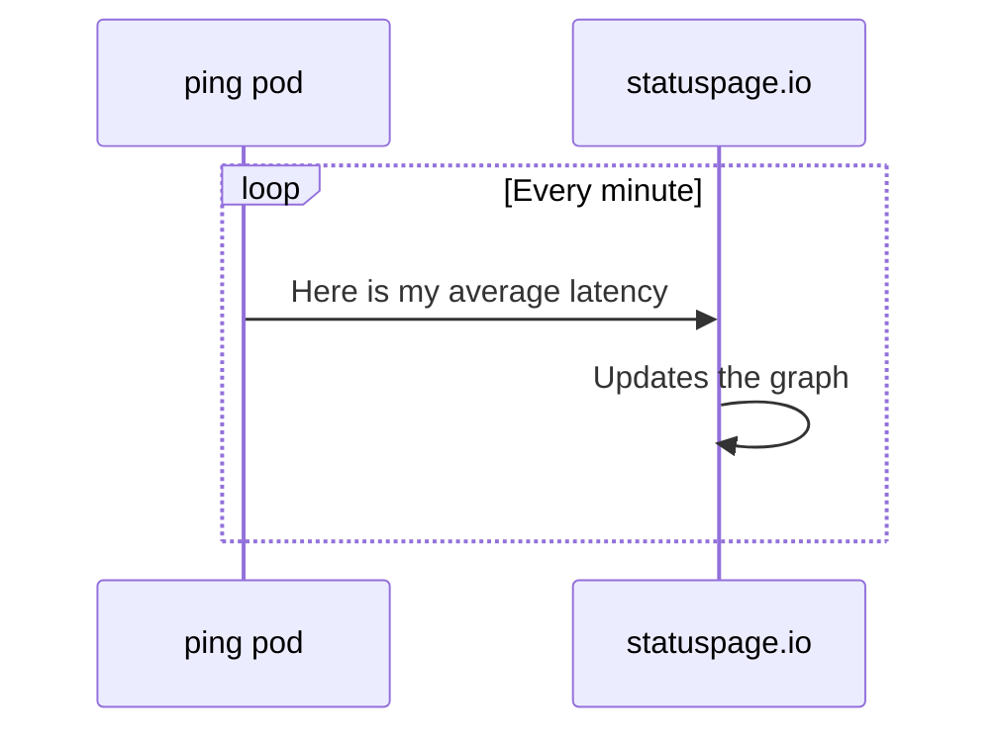
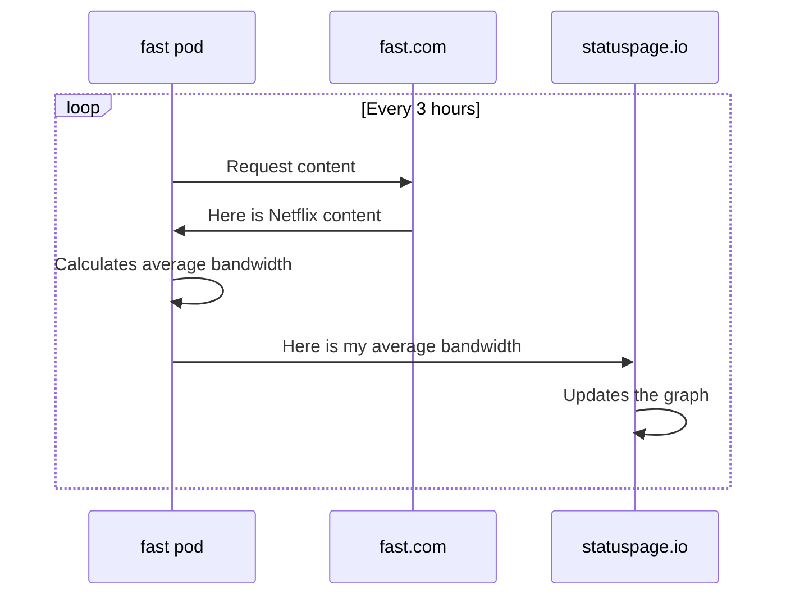

# About
I had a really crapy home internet connection so I wanted to know how much uptime I was actually getting, so I took advantage of a rasberry pi I had lying around, rigged up a lambda function, and published my results to statuspage.io's.  

If you want to monitor your home internet you can do the same, but you will need the following.
* A local kubernetes cluster at your house. I am using a rasberry pi 4 running k3s. You can do it without kuberntes if you want, but this guide assumes that you have one.
* The ability to port forward on your router.
* A duckdns.org account
* An AWS account
* A statuspage.io account

All three providers listed above have free tiers that you can use for this project so it shouldn't cost you anything apart from hardware costs.

# Design
There are several services provided by this chart. 

## Uptime
The first is a general internet uptime monitor. An AWS lambda function will query an nginx server running on a local kubernetes cluster. If the nginx server responds, the lambda will tell statuspage.io to mark the component as up. If it does not it marks the component as down.



The lambda function is in another repo. Check out https://github.com/fuele/statuspage-updater
It will provide you with instructions on how to set it up and what values you will need.

## Dynamic DNS
In order for the dynamic ip address to be discoverable, we use the duckdns.org service. Every 5 minutes a cronjob kicks off on kubernetes and notifies duckdns.org of our new IP address.

## Latency Monitor
statuspage.io also offers graphs of metric values. One of the metrics we track is latency. A cronjob creates a pod that pings cloudflare's 1.1.1.1 address, records the latency, and uploads the results to statuspage.io


## Bandwidth Monitor
Additionally we monitor our average bandwidth to see if we are getting what we are promised. To do this we use the 3rd party cli tool for fast.com. (https://github.com/ddo/fast). This downloads content from Netflix's servers and determines the average bandwidth. This only runs every three hours since it can be a bandwidth hog and we don't want anyone to hit their data cap. 




# CRI-O
As of CRI-O 1.18.0 pods by default do not have NET_RAW permissions which measn they cannot run the `ping` command (https://cri-o.github.io/cri-o/v1.18.0.html). One of our metrics requires ping to function properly. To re-enable this capability, edit /etc/crio/crio.conf to include the following then restart crio.service.
```
[crio.runtime]

default_capabilities = [
          "CHOWN",
          "DAC_OVERRIDE",
          "FSETID",
          "FOWNER",
          "SETGID",
          "SETUID",
          "SETPCAP",
          "NET_BIND_SERVICE",
          "KILL",
          "NET_RAW",
  ]
```

If you are not using CRI-O as your CRI then you don't need to do this step.

# Duckdns.org
Create an account with duck dns.org and note down the token and domain.

# Statuspage.io
Create an account. Click components. Add component. Add a name and description and leave the rest as default. Click save component. 
Click on your avatar in the bottom left of your screen tokk access the user menu. Click API info. Under the `Organization API keys` you'll see your api keys. Note that secret down. 
At the bottom of the screen under `Page IDs` you should see your page id. Note this token down too.
Click on `Your page` and then `System Metrics` and add two metrics, Bandwidth and Latency.
Click on the metric, go under advanced options and note down the two metric ids.

# Web server installation

## Kubernetes manual work
Login to your kubernetes cluster and create a namespace with:
```
kubectl create namespace statuspage
```

Next create an empty secret to hold your duckdns token in that namespace
```
kubectl create secret generic duckdns -n statuspage
```

Secrets must be encoded. Get the base64 encoded token by running and filling in the token you got from duckdns.org.
```
echo -n <token> | base64
```

Plug that into your secret by running 
```
kubectl edit secret duckdns -n statuspage
```
Add the following and paste in your base64 encoded key.
```
data:
  TOKEN: <base64 token>
```

## Statuspage secret
Create a secret like you did before with duckdns.org

```
kubectl create secret generic statuspage -n statuspage

echo -n <token> | base64
kubectl edit secret statuspage -n statuspage
```

Add the following and paste in your base64 encoded api token:
```
data:
  TOKEN: <base64 token>
```


## helm install
In this repo, navigate to charts and open values.yaml. Fill in the missing duckdns domain name.
Put in your statuspage
* pageId
* metric id for bandwidth
* metric id for latency

Next run
```
helm install statuspage -n statuspage . -f values.yaml
```
This should install everything. You can verify it's working by running 
```
curl http://localhost:30008
```
Note that it only needs to return any response to the lambda function to be marked as up. Even a 40x or 50x response is sufficient.

# Port forwarding
Next set the port forwarding on your router to the new service running on your node's IP and port 30008.


